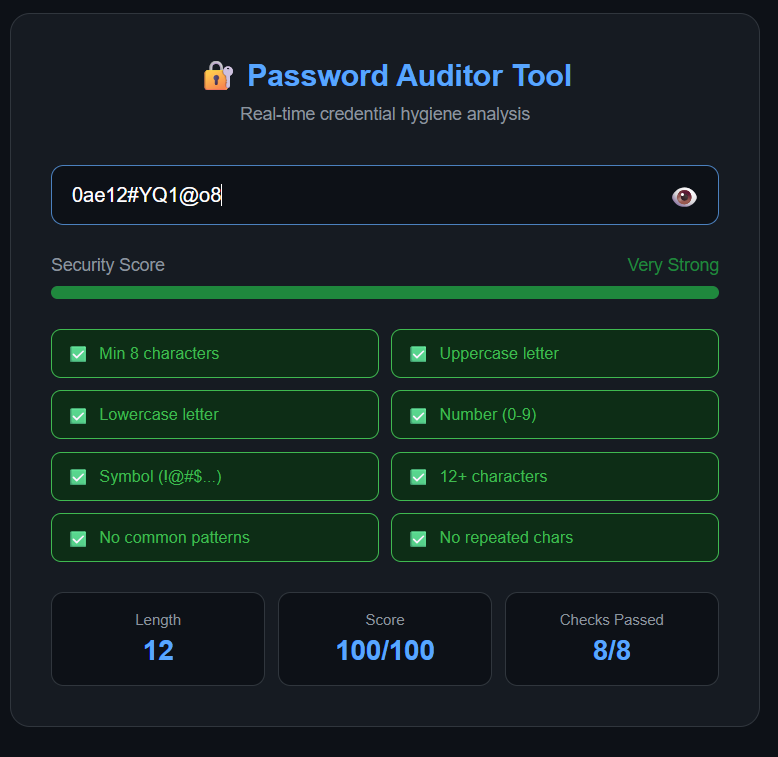

# 🔐 Password Auditor Tool

> A real-time password strength analyzer that evaluates credential hygiene and educates users on creating secure passwords.


---

## 📌 Table of Contents

- [Overview](#-overview)
- [Live Demo](#-live-demo)
- [Features](#-features)
- [Security Checks](#-security-checks)
- [Scoring System](#-scoring-system)
- [File Structure](#-file-structure)
- [Getting Started](#-getting-started)
- [Technologies Used](#-technologies-used)
- [Screenshots](#-screenshots)
- [Author](#-author)
- [License](#-license)

---

## 📋 Overview

The **Password Auditor Tool** is a lightweight, browser-based utility built with vanilla HTML, CSS, and JavaScript. It provides **real-time feedback** on password strength using 8 security checks, a 0–100 scoring system, and personalized recommendations — helping users understand and adopt stronger password practices.

This project was built as part of a cybersecurity internship at **CovalentX**.

---

## 🚀 Live Demo

🔗 **[Try it here → muntaha-ghafoor.github.io/Password-Auditor-Tool](https://muntaha-ghafoor.github.io/Password-Auditor-Tool/)**

---

## 🎯 Features

- ✅ **Real-time password scoring** (0–100 scale)
- ✅ **Color-coded strength indicator** (Very Weak → Very Strong)
- ✅ **8 comprehensive security checks**
- ✅ **Common pattern detection** (e.g., `password`, `123456`, `qwerty`)
- ✅ **Personalized recommendations** based on missing criteria
- ✅ **Show/Hide password toggle** for usability
- ✅ **Zero dependencies** — pure HTML, CSS, and JavaScript

---

## 📊 Security Checks

| # | Check | Description |
|---|-------|-------------|
| 1 | **Min Length** | Password must be at least 8 characters |
| 2 | **Uppercase** | Must contain at least one uppercase letter (A–Z) |
| 3 | **Lowercase** | Must contain at least one lowercase letter (a–z) |
| 4 | **Numbers** | Must include at least one digit (0–9) |
| 5 | **Symbols** | Must include at least one special character (`!@#$%^&*`) |
| 6 | **Long Password** | Bonus strength for 12+ character passwords |
| 7 | **No Common Patterns** | Detects and penalizes common words/sequences |
| 8 | **No Repeated Characters** | Flags excessive character repetition |

---

## 🔐 Scoring System

| Score Range | Strength Level | Indicator Color |
|-------------|---------------|-----------------|
| 0 – 29 | Very Weak | 🔴 Red |
| 30 – 49 | Weak | 🟠 Orange |
| 50 – 69 | Fair | 🟡 Yellow |
| 70 – 84 | Strong | 🟢 Green |
| 85 – 100 | Very Strong | 🔵 Blue |

---

## 📁 File Structure

```
Password-Auditor-Tool/
│
├── index.html        # Main UI structure
├── style.css         # Styling and animations
├── script.js         # Core password analysis logic
└── README.md         # Project documentation
```

---

## ⚡ Getting Started

### Option 1 — Open directly in browser

```bash
# Clone the repository
git clone https://github.com/Muntaha-Ghafoor/Password-Auditor-Tool.git

# Navigate into the project folder
cd Password-Auditor-Tool

# Open in your browser
open index.html
```

### Option 2 — VS Code Live Server

1. Open the project folder in **VS Code**
2. Install the [Live Server extension](https://marketplace.visualstudio.com/items?itemName=ritwickdey.LiveServer)
3. Right-click `index.html` → **Open with Live Server**

---

## 🔧 Technologies Used

| Technology | Purpose |
|------------|---------|
| **HTML5** | Page structure and layout |
| **CSS3** | Styling, animations, strength bar |
| **JavaScript (Vanilla)** | Real-time password analysis logic |

No frameworks, no libraries, no build tools — fully self-contained.

---

## 📸 Screenshots

| Empty State | Fair Strength | Strong Password |
|:-----------:|:-------------:|:---------------:|
|  |  |  |

---

## 👤 Author

**Muntaha Ghafoor**

[](https://www.linkedin.com/in/muntaha-ghafoor-2b87a9386)
[](https://github.com/Muntaha-Ghafoor)

---

## 📜 License

This project is licensed under the **MIT License** — feel free to use, modify, and distribute it.

---

> 💡 *Built with ❤️ as part of the CovalentX Cybersecurity Internship Program*
